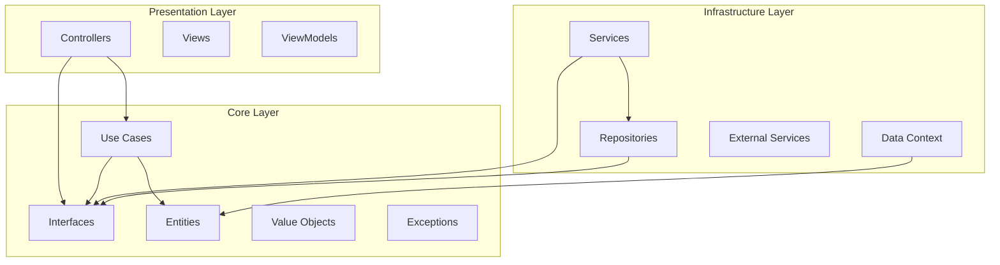

# Design Document: Clean Code Refactoring

## Overview

This design outlines a comprehensive refactoring approach for the Online Book Management System to apply Clean Code principles, SOLID principles, and proper Separation of Concerns. The refactoring will be executed incrementally to maintain system functionality while systematically improving code quality, testability, and maintainability.

The approach focuses on:
- Resolving immediate build errors from ViewModel reorganization
- Applying SOLID principles systematically across all layers
- Implementing proper dependency injection and inversion of control
- Eliminating code duplication and improving method complexity
- Establishing consistent naming conventions and error handling

## Architecture

### Current Architecture Analysis

The system follows Clean Architecture with these layers:
- **Core Layer**: Domain entities, Application interfaces, DTOs, Use cases
- **Infrastructure Layer**: Data access, Services, Repositories, EF Core configurations  
- **Presentation Layer**: Controllers, Views, ViewModels (newly organized)
- **Shared Layer**: Extensions, Utilities

### Target Architecture Improvements



### Dependency Flow Improvements

1. **Presentation → Core**: Controllers depend only on Use Cases and Application interfaces
2. **Core → Infrastructure**: Core defines interfaces, Infrastructure implements them
3. **Infrastructure → Core**: Infrastructure depends on Core abstractions only
4. **Shared → All**: Shared utilities can be used by all layers

## Components and Interfaces

### Service Layer Refactoring

#### Current Issues
- Large service classes violating Single Responsibility Principle
- Direct dependencies between services
- Mixed concerns within single services

#### Target Design

**Book Management Services**:
```csharp
// Split BookService into focused services
public interface IBookQueryService
{
    Task<BookDto> GetByIdAsync(int id);
    Task<PagedResult<BookDto>> SearchAsync(BookSearchCriteria criteria);
    Task<IEnumerable<BookDto>> GetFeaturedAsync();
}

public interface IBookCommandService  
{
    Task<int> CreateAsync(CreateBookCommand command);
    Task UpdateAsync(UpdateBookCommand command);
    Task DeleteAsync(int id);
}

public interface IBookValidationService
{
    Task<ValidationResult> ValidateCreateAsync(CreateBookCommand command);
    Task<ValidationResult> ValidateUpdateAsync(UpdateBookCommand command);
}
```

**User Management Services**:
```csharp
public interface IUserQueryService
{
    Task<UserDto> GetByIdAsync(int id);
    Task<UserDto> GetByEmailAsync(string email);
}

public interface IUserCommandService
{
    Task<int> CreateAsync(CreateUserCommand command);
    Task UpdateAsync(UpdateUserCommand command);
}

public interface IUserAuthenticationService
{
    Task<AuthResult> AuthenticateAsync(LoginCommand command);
    Task<AuthResult> RefreshTokenAsync(string refreshToken);
}
```

### Repository Pattern Improvements

#### Interface Segregation for Repositories

```csharp
// Split large repository interfaces
public interface IBookReadRepository
{
    Task<Book> GetByIdAsync(int id);
    Task<IEnumerable<Book>> GetByIdsAsync(IEnumerable<int> ids);
    Task<PagedResult<Book>> SearchAsync(BookSearchCriteria criteria);
}

public interface IBookWriteRepository
{
    Task<int> AddAsync(Book book);
    Task UpdateAsync(Book book);
    Task DeleteAsync(int id);
}

public interface IBookQueryRepository
{
    Task<bool> ExistsAsync(int id);
    Task<bool> IsbnExistsAsync(string isbn);
    Task<int> CountByCategoryAsync(int categoryId);
}
```

### Unit of Work Pattern Enhancement

```csharp
public interface IUnitOfWork : IDisposable
{
    IBookWriteRepository Books { get; }
    IUserWriteRepository Users { get; }
    IOrderWriteRepository Orders { get; }
    
    Task<int> SaveChangesAsync();
    Task BeginTransactionAsync();
    Task CommitTransactionAsync();
    Task RollbackTransactionAsync();
}
```

## Data Models

### Domain Entity Improvements

#### Value Objects Implementation
```csharp
public class ISBN : ValueObject
{
    public string Value { get; private set; }
    
    private ISBN(string value)
    {
        Value = value;
    }
    
    public static ISBN Create(string value)
    {
        if (string.IsNullOrWhiteSpace(value))
            throw new DomainException("ISBN cannot be empty");
            
        if (!IsValidFormat(value))
            throw new DomainException("Invalid ISBN format");
            
        return new ISBN(value);
    }
    
    private static bool IsValidFormat(string isbn) => 
        Regex.IsMatch(isbn, @"^(?:ISBN(?:-1[03])?:? )?(?=[0-9X]{10}$|(?=(?:[0-9]+[- ]){3})[- 0-9X]{13}$|97[89][0-9]{10}$|(?=(?:[0-9]+[- ]){4})[- 0-9]{17}$)(?:97[89][- ]?)?[0-9]{1,5}[- ]?[0-9]+[- ]?[0-9]+[- ]?[0-9X]$");
}
```

#### Domain Entity Enhancements
```csharp
public class Book : BaseEntity
{
    public string Title { get; private set; }
    public ISBN ISBN { get; private set; }
    public Money Price { get; private set; }
    public int CategoryId { get; private set; }
    
    private readonly List<Review> _reviews = new();
    public IReadOnlyCollection<Review> Reviews => _reviews.AsReadOnly();
    
    public void UpdatePrice(Money newPrice)
    {
        if (newPrice.Amount <= 0)
            throw new DomainException("Price must be greater than zero");
            
        Price = newPrice;
        UpdatedAt = DateTime.UtcNow;
    }
    
    public void AddReview(Review review)
    {
        if (review == null)
            throw new ArgumentNullException(nameof(review));
            
        _reviews.Add(review);
    }
}
```

### DTO and Command/Query Objects

```csharp
// Command objects for write operations
public class CreateBookCommand
{
    public string Title { get; set; }
    public string ISBN { get; set; }
    public decimal Price { get; set; }
    public int CategoryId { get; set; }
    public string Description { get; set; }
}

// Query objects for read operations  
public class BookSearchCriteria
{
    public string Title { get; set; }
    public int? CategoryId { get; set; }
    public decimal? MinPrice { get; set; }
    public decimal? MaxPrice { get; set; }
    public int PageNumber { get; set; } = 1;
    public int PageSize { get; set; } = 10;
}

// Result objects
public class PagedResult<T>
{
    public IEnumerable<T> Items { get; set; }
    public int TotalCount { get; set; }
    public int PageNumber { get; set; }
    public int PageSize { get; set; }
    public int TotalPages => (int)Math.Ceiling((double)TotalCount / PageSize);
}
```

## Correctness Properties

*A property is a characteristic or behavior that should hold true across all valid executions of a system—essentially, a formal statement about what the system should do. Properties serve as the bridge between human-readable specifications and machine-verifiable correctness guarantees.*

Based on the prework analysis, I've identified properties that can be automatically validated through property-based testing. These properties focus on structural and architectural constraints that can be measured objectively.

### Property 1: Namespace Resolution Consistency
*For any* ViewModel reference in controllers or views, the namespace should resolve correctly without compilation errors
**Validates: Requirements 1.2, 1.3**

### Property 2: Domain-Specific ViewModel Organization
*For any* ViewModel class, it should be located in the correct domain-specific folder according to its responsibility (Admin, Books, Cart, User, SuperAdmin, Activity, Shared, Reviews)
**Validates: Requirements 1.4**

### Property 3: Specific Namespace Usage
*For any* using statement in the codebase, it should use the most specific namespace available rather than overly broad namespaces
**Validates: Requirements 1.5**

### Property 4: Constructor Dependency Injection
*For any* service class, all dependencies should be received through constructor injection rather than created internally or accessed statically
**Validates: Requirements 3.1**

### Property 5: Service Lifetime Registration
*For any* service registration in the DI container, it should have an explicitly specified lifetime (Scoped, Singleton, or Transient)
**Validates: Requirements 3.2**

### Property 6: Dependency on Abstractions
*For any* constructor parameter or field in service classes, it should be an interface or abstract class rather than a concrete implementation
**Validates: Requirements 3.3**

### Property 7: No Static Dependencies
*For any* service class, it should not contain static method calls to service locators or static dependencies
**Validates: Requirements 3.4**

### Property 8: Mockable Dependencies
*For any* service class, all its dependencies should be interfaces to ensure they are easily mockable for testing
**Validates: Requirements 3.5**

### Property 9: Centralized Validation Logic
*For any* validation logic, it should exist in dedicated validator classes rather than being scattered throughout controllers or services
**Validates: Requirements 4.2**

### Property 10: Consistent Mapping Strategy
*For any* object mapping operation, it should use a consistent mapping mechanism (AutoMapper, dedicated mapping services, or extension methods)
**Validates: Requirements 4.3**

### Property 11: Interface Method Usage
*For any* class implementing an interface, it should meaningfully use all methods from that interface (not have empty implementations or throw NotImplementedException)
**Validates: Requirements 5.2**

### Property 12: Repository Interface Organization
*For any* repository interface, its name should clearly indicate its aggregate root or functional area (e.g., IBookRepository, IUserRepository)
**Validates: Requirements 5.4**

### Property 13: Service Interface Organization
*For any* service interface, its name should clearly indicate its business capability (e.g., IBookQueryService, IUserCommandService)
**Validates: Requirements 5.5**

### Property 14: Method Length Constraint
*For any* method in service or controller classes, it should not exceed 20 lines of code
**Validates: Requirements 6.1**

### Property 15: Cyclomatic Complexity Constraint
*For any* method in the codebase, it should have a cyclomatic complexity of 10 or less
**Validates: Requirements 6.2**

### Property 16: Parameter Count Constraint
*For any* method, it should have 5 or fewer parameters (suggesting use of parameter objects for methods with more parameters)
**Validates: Requirements 6.5**

### Property 17: C# Naming Conventions
*For any* class member, it should follow C# naming conventions (PascalCase for public members, camelCase for private members)
**Validates: Requirements 7.1, 7.5**

### Property 18: Interface Naming Convention
*For any* interface, its name should start with 'I' followed by a descriptive name
**Validates: Requirements 7.2**

### Property 19: Core Layer Independence
*For any* class in the Core layer, it should not reference Infrastructure or Presentation layer assemblies
**Validates: Requirements 8.1**

### Property 20: Infrastructure Layer Dependencies
*For any* class in the Infrastructure layer, it should only reference Core layer abstractions and not other infrastructure implementations
**Validates: Requirements 8.2**

### Property 21: Presentation Layer Dependencies
*For any* controller in the Presentation layer, it should only depend on Core application interfaces
**Validates: Requirements 8.3**

### Property 22: Domain Entity Purity
*For any* domain entity class, it should not contain infrastructure-specific attributes (like data annotations) or dependencies
**Validates: Requirements 8.4**

### Property 23: Business Logic Placement
*For any* controller or repository method, it should not contain complex business logic (measured by cyclomatic complexity > 5)
**Validates: Requirements 8.5**

### Property 24: Exception Handling at Boundaries
*For any* controller action, it should have appropriate exception handling (try-catch blocks or global exception handling)
**Validates: Requirements 9.1**

### Property 25: Domain Exception Usage
*For any* domain class method that can fail, it should throw custom domain exceptions rather than generic exceptions
**Validates: Requirements 9.2**

### Property 26: Structured Validation Results
*For any* validation method, it should return structured validation result objects rather than throwing exceptions or returning simple booleans
**Validates: Requirements 9.3**

### Property 27: Error Logging Implementation
*For any* exception handling block, it should include appropriate logging statements
**Validates: Requirements 9.4**

### Property 28: Secure Error Messages
*For any* exception message exposed to users, it should not contain sensitive internal implementation details
**Validates: Requirements 9.5**

### Property 29: Testable Component Dependencies
*For any* service or use case class, all its dependencies should be interfaces to support dependency injection and testing
**Validates: Requirements 10.1, 10.3, 10.4**

### Property 30: Business Logic Isolation
*For any* business logic class, it should not directly depend on infrastructure classes (database contexts, external service clients)
**Validates: Requirements 10.2**

### Property 31: Domain Entity Independence
*For any* domain entity, it should not have dependencies on database contexts or external service interfaces
**Validates: Requirements 10.5**

## Error Handling

### Exception Hierarchy
```csharp
public abstract class DomainException : Exception
{
    protected DomainException(string message) : base(message) { }
    protected DomainException(string message, Exception innerException) : base(message, innerException) { }
}

public class ValidationException : DomainException
{
    public ValidationResult ValidationResult { get; }
    
    public ValidationException(ValidationResult validationResult) 
        : base("Validation failed")
    {
        ValidationResult = validationResult;
    }
}

public class BusinessRuleException : DomainException
{
    public string RuleCode { get; }
    
    public BusinessRuleException(string ruleCode, string message) : base(message)
    {
        RuleCode = ruleCode;
    }
}
```

### Global Exception Handling
```csharp
public class GlobalExceptionMiddleware
{
    public async Task InvokeAsync(HttpContext context, RequestDelegate next)
    {
        try
        {
            await next(context);
        }
        catch (ValidationException ex)
        {
            await HandleValidationExceptionAsync(context, ex);
        }
        catch (BusinessRuleException ex)
        {
            await HandleBusinessRuleExceptionAsync(context, ex);
        }
        catch (Exception ex)
        {
            await HandleGenericExceptionAsync(context, ex);
        }
    }
}
```

### Validation Result Pattern
```csharp
public class ValidationResult
{
    public bool IsValid { get; private set; }
    public List<ValidationError> Errors { get; private set; } = new();
    
    public static ValidationResult Success() => new() { IsValid = true };
    
    public static ValidationResult Failure(params ValidationError[] errors) => 
        new() { IsValid = false, Errors = errors.ToList() };
}

public class ValidationError
{
    public string PropertyName { get; set; }
    public string ErrorMessage { get; set; }
    public string ErrorCode { get; set; }
}
```

## Testing Strategy

### Dual Testing Approach

The refactoring will implement both unit testing and property-based testing as complementary approaches:

**Unit Tests**:
- Test specific examples and edge cases
- Verify integration points between refactored components
- Test error conditions and exception handling
- Validate specific business scenarios

**Property-Based Tests**:
- Verify universal properties across all inputs
- Test architectural constraints and code quality rules
- Validate naming conventions and structural requirements
- Ensure SOLID principles compliance

### Property-Based Testing Configuration

**Testing Framework**: Use **FsCheck** for .NET property-based testing
- Minimum 100 iterations per property test
- Each property test references its design document property
- Tag format: **Feature: clean-code-refactoring, Property {number}: {property_text}**

**Example Property Test**:
```csharp
[Property]
[Tag("Feature: clean-code-refactoring, Property 14: Method Length Constraint")]
public Property MethodsShouldNotExceedTwentyLines()
{
    return Prop.ForAll<Type>(type =>
    {
        if (!IsServiceOrControllerType(type)) return true;
        
        var methods = type.GetMethods(BindingFlags.Public | BindingFlags.Instance);
        return methods.All(method => GetMethodLineCount(method) <= 20);
    });
}
```

### Testing Categories

1. **Structural Tests**: Verify architectural constraints and dependencies
2. **Quality Tests**: Validate code quality metrics and naming conventions  
3. **Behavior Tests**: Test business logic and use case implementations
4. **Integration Tests**: Verify component interactions after refactoring

### Test Organization
```
Tests/
├── Unit/
│   ├── Core/
│   ├── Infrastructure/
│   └── Presentation/
├── Properties/
│   ├── Architecture/
│   ├── CodeQuality/
│   └── Naming/
└── Integration/
    ├── Services/
    └── Repositories/
```

This comprehensive testing strategy ensures that the refactoring maintains system functionality while improving code quality and architectural compliance.