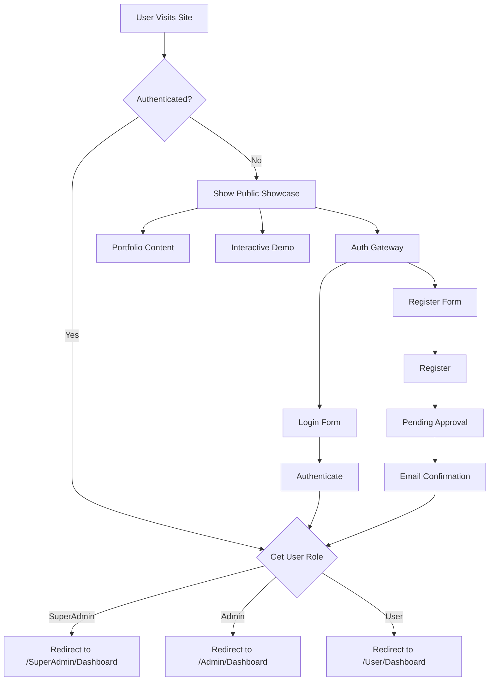

# Enhanced Public Showcase Landing Page - Design Document

## Overview

The Enhanced Public Showcase transforms the current basic public landing page into a comprehensive project portfolio and authentication gateway. This design eliminates the concept of "public role" for authenticated users, creating a clear separation between the showcase (public) area and the application (authenticated) areas.

The showcase serves dual purposes:
1. **Portfolio Piece**: Demonstrates technical capabilities, architecture decisions, and development expertise
2. **Authentication Gateway**: Provides streamlined paths for user registration and login with role-based redirection

## Architecture

### High-Level Architecture

The enhanced public showcase integrates seamlessly with the existing Clean Architecture implementation:

```
┌─────────────────────────────────────────────────────────────┐
│                    Presentation Layer                        │
├─────────────────────────────────────────────────────────────┤
│  PublicController (Enhanced)                                │
│  ├── ShowcaseActions (Portfolio content)                    │
│  ├── DemoActions (Interactive book browsing)                │
│  └── AuthGatewayActions (Login/Register flows)              │
├─────────────────────────────────────────────────────────────┤
│                   Application Layer                         │
├─────────────────────────────────────────────────────────────┤
│  Existing Use Cases (Reused)                               │
│  ├── SearchBooksUseCase (Read-only mode)                   │
│  ├── GetBookByIdUseCase (Public view)                      │
│  └── GetCategoriesUseCase (Statistics)                     │
├─────────────────────────────────────────────────────────────┤
│                   Infrastructure Layer                      │
├─────────────────────────────────────────────────────────────┤
│  Existing Services (Reused)                                │
│  ├── BookQueryService (Read-only access)                   │
│  ├── AuthService (Enhanced redirection)                    │
│  └── AnalyticsService (Statistics)                         │
└─────────────────────────────────────────────────────────────┘
```

### Authentication Flow Enhancement



## Components and Interfaces

### 1. Enhanced PublicController

**New Actions:**
- `Showcase()` - Main portfolio landing page
- `TechnicalDetails()` - Architecture and implementation details
- `InteractiveDemo()` - Live system demonstration
- `DeveloperStory()` - Project journey and motivation

**Enhanced Actions:**
- `Index()` - Redirects authenticated users, shows showcase for guests
- `Browse()` - Enhanced with portfolio context
- `BookDetails()` - Enhanced with technical implementation notes

### 2. Showcase ViewModels

```csharp
public class ShowcaseViewModel
{
    public ProjectOverviewViewModel ProjectOverview { get; set; }
    public TechnicalStackViewModel TechnicalStack { get; set; }
    public ArchitectureViewModel Architecture { get; set; }
    public SystemStatisticsViewModel Statistics { get; set; }
    public DeveloperStoryViewModel DeveloperStory { get; set; }
    public List<FeatureHighlightViewModel> FeatureHighlights { get; set; }
}

public class ProjectOverviewViewModel
{
    public string Vision { get; set; }
    public string ValueProposition { get; set; }
    public List<string> KeyFeatures { get; set; }
    public string ProjectStatus { get; set; }
}

public class TechnicalStackViewModel
{
    public List<TechnologyViewModel> BackendTechnologies { get; set; }
    public List<TechnologyViewModel> FrontendTechnologies { get; set; }
    public List<TechnologyViewModel> DatabaseTechnologies { get; set; }
    public List<TechnologyViewModel> DevOpsTechnologies { get; set; }
}

public class ArchitectureViewModel
{
    public string ArchitectureType { get; set; } // "Clean Architecture"
    public List<LayerViewModel> Layers { get; set; }
    public List<PrincipleViewModel> SOLIDPrinciples { get; set; }
    public string DiagramUrl { get; set; }
}

public class SystemStatisticsViewModel
{
    public int TotalBooks { get; set; }
    public int TotalCategories { get; set; }
    public int TotalUsers { get; set; }
    public decimal AverageRating { get; set; }
    public int TotalOrders { get; set; }
    public DateTime LastUpdated { get; set; }
}
```

### 3. Interactive Demo Components

**Read-Only Data Access Pattern:**
```csharp
public interface IPublicDemoService
{
    Task<BookListViewModel> GetFeaturedBooksAsync(int count = 8);
    Task<List<CategoryDto>> GetCategoriesWithCountsAsync();
    Task<BookListViewModel> SearchBooksAsync(string query, int page = 1, int pageSize = 12);
    Task<BookDetailsViewModel> GetBookDetailsAsync(int bookId);
    Task<SystemStatisticsViewModel> GetSystemStatisticsAsync();
}
```

### 4. Enhanced Authentication Gateway

**Role-Based Redirection Service:**
```csharp
public interface IRoleBasedRedirectionService
{
    Task<string> GetRedirectUrlForUserAsync(int userId);
    Task<string> GetDefaultRedirectForRoleAsync(string role);
    bool ShouldBypassPublicArea(ClaimsPrincipal user);
}
```

## Data Models

### 1. Showcase Content Models

```csharp
public class ShowcaseContent
{
    public int Id { get; set; }
    public string SectionName { get; set; }
    public string Title { get; set; }
    public string Content { get; set; }
    public string ImageUrl { get; set; }
    public int DisplayOrder { get; set; }
    public bool IsActive { get; set; }
    public DateTime CreatedAt { get; set; }
    public DateTime UpdatedAt { get; set; }
}

public class TechnicalHighlight
{
    public int Id { get; set; }
    public string Category { get; set; } // "Architecture", "Performance", "Security"
    public string Title { get; set; }
    public string Description { get; set; }
    public string CodeExample { get; set; }
    public string DocumentationUrl { get; set; }
    public int DisplayOrder { get; set; }
}

public class FeatureShowcase
{
    public int Id { get; set; }
    public string FeatureName { get; set; }
    public string Description { get; set; }
    public string ScreenshotUrl { get; set; }
    public List<string> TechnicalDetails { get; set; }
    public string DemoUrl { get; set; }
    public bool IsInteractive { get; set; }
}
```

### 2. Enhanced Statistics Models

```csharp
public class PublicStatistics
{
    public SystemStats SystemStats { get; set; }
    public PerformanceStats PerformanceStats { get; set; }
    public TechnicalStats TechnicalStats { get; set; }
}

public class SystemStats
{
    public int TotalBooks { get; set; }
    public int TotalCategories { get; set; }
    public int ActiveUsers { get; set; }
    public decimal AverageRating { get; set; }
    public int CompletedOrders { get; set; }
}

public class TechnicalStats
{
    public int LinesOfCode { get; set; }
    public int TestCoverage { get; set; }
    public string ArchitectureCompliance { get; set; }
    public int PerformanceScore { get; set; }
}
```

## Correctness Properties

*A property is a characteristic or behavior that should hold true across all valid executions of a system—essentially, a formal statement about what the system should do. Properties serve as the bridge between human-readable specifications and machine-verifiable correctness guarantees.*

### Property Reflection

After analyzing the acceptance criteria, I identified several properties that can be consolidated:
- Multiple content display properties (hero section, developer story, architecture highlights, etc.) can be combined into comprehensive content validation properties
- Authentication redirection properties can be unified into role-based redirection properties
- Data display properties (books, categories, statistics) can be consolidated into data integrity properties

### Core Properties

**Property 1: Authenticated User Bypass**
*For any* authenticated user with a valid role, accessing the public showcase should result in immediate redirection to their role-specific dashboard without displaying public content
**Validates: Requirements 6.1, 6.2, 6.3**

**Property 2: Role-Based Dashboard Redirection**
*For any* authenticated user, the redirection URL should correspond exactly to their highest-priority role (SuperAdmin > Admin > User)
**Validates: Requirements 6.2, 6.4**

**Property 3: Live Data Display Integrity**
*For any* public demo feature (books, categories, search), the displayed data should match the current database state and be read-only
**Validates: Requirements 3.1, 3.2, 3.3, 7.1, 7.2**

**Property 4: System Statistics Accuracy**
*For any* system statistic displayed on the public showcase, the value should be calculated correctly from current database data
**Validates: Requirements 3.4**

**Property 5: Search Functionality Read-Only**
*For any* search operation in the public demo, results should be returned from live data without allowing any data modifications
**Validates: Requirements 3.3, 7.3**

**Property 6: Modern Effects Application**
*For any* showcase element with modern effect classes, the corresponding CSS effects should be properly applied and functional
**Validates: Requirements 2.3, 10.2**

**Property 7: Responsive Design Adaptation**
*For any* screen size or device type, the showcase layout should adapt appropriately using responsive design patterns
**Validates: Requirements 10.3**

**Property 8: Accessibility Compliance**
*For any* interactive element in the showcase, accessibility attributes and keyboard navigation should be properly implemented
**Validates: Requirements 10.4**

**Property 9: Category Browsing Accuracy**
*For any* category displayed in the public demo, the book count should match the actual number of books in that category
**Validates: Requirements 3.2, 7.4**

**Property 10: Book Detail Completeness**
*For any* book detail page in the public demo, all required book information fields should be displayed
**Validates: Requirements 7.2**

## Error Handling

### 1. Data Access Errors

**Graceful Degradation Strategy:**
- If book data is unavailable, show placeholder content with clear messaging
- If statistics calculation fails, display cached values with timestamp
- If search service is down, show static featured content

```csharp
public async Task<BookListViewModel> GetFeaturedBooksWithFallbackAsync()
{
    try
    {
        return await _bookQueryService.GetPaginatedBooksAsync(1, 8, null, null, "createdDate");
    }
    catch (Exception ex)
    {
        _logger.LogError(ex, "Failed to load featured books, using fallback");
        return GetFallbackFeaturedBooks();
    }
}
```

### 2. Authentication Errors

**Secure Error Handling:**
- Never expose authentication internals in public area
- Log security-related errors for monitoring
- Provide generic error messages to users

### 3. Performance Degradation

**Performance Safeguards:**
- Implement circuit breaker pattern for external dependencies
- Cache showcase content with appropriate TTL
- Provide loading states for slow operations

## Testing Strategy

### Dual Testing Approach

The testing strategy combines unit tests for specific scenarios with property-based tests for comprehensive coverage:

**Unit Tests Focus:**
- Specific showcase content rendering
- Authentication redirection scenarios
- Error handling edge cases
- Integration points between components

**Property-Based Tests Focus:**
- Universal properties across all user roles and data states
- Comprehensive input coverage through randomization
- Data integrity validation across different system states

### Property-Based Testing Configuration

**Testing Library:** Use NUnit with FsCheck.NUnit for .NET property-based testing
**Test Configuration:**
- Minimum 100 iterations per property test
- Each property test references its design document property
- Tag format: **Feature: enhanced-public-showcase, Property {number}: {property_text}**

**Example Property Test Structure:**
```csharp
[Property]
[Category("Feature: enhanced-public-showcase, Property 1: Authenticated User Bypass")]
public Property AuthenticatedUsersBypassPublicArea()
{
    return Prop.ForAll(
        GenerateAuthenticatedUser(),
        user => {
            var result = _publicController.Index();
            return result is RedirectResult redirect && 
                   redirect.Url.Contains(GetExpectedDashboardPath(user.Role));
        });
}
```

### Integration Testing

**Key Integration Points:**
- Public showcase with existing authentication system
- Demo functionality with live data services
- Modern effects with responsive design
- SEO optimization with content management

### Performance Testing

**Performance Benchmarks:**
- Page load time < 2 seconds (measured via automated tools)
- Modern effects render smoothly (60fps target)
- Search response time < 500ms
- Image optimization and lazy loading effectiveness

## Implementation Phases

### Phase 1: Core Infrastructure (Week 1)
1. Enhance PublicController with new actions
2. Create showcase ViewModels and data structures
3. Implement role-based redirection service
4. Set up read-only data access patterns

### Phase 2: Content and Portfolio (Week 2)
1. Create showcase content management
2. Implement developer story and technical highlights
3. Add architecture diagrams and explanations
4. Create feature showcase components

### Phase 3: Interactive Demo (Week 3)
1. Enhance book browsing with portfolio context
2. Implement read-only search and filtering
3. Add system statistics display
4. Create interactive feature demonstrations

### Phase 4: Visual Enhancement (Week 4)
1. Apply modern effects and animations
2. Implement responsive design patterns
3. Add accessibility features
4. Optimize for performance and SEO

### Phase 5: Testing and Polish (Week 5)
1. Implement comprehensive test suite
2. Performance optimization and monitoring
3. Security review and hardening
4. Documentation and deployment preparation

## Security Considerations

### 1. Data Exposure Prevention

**Read-Only Access Patterns:**
- All public demo functionality uses read-only database connections
- Sensitive user data is filtered from public views
- Administrative data is never exposed in public context

**Data Sanitization:**
```csharp
public class PublicBookDto
{
    public int Id { get; set; }
    public string Title { get; set; }
    public string Author { get; set; }
    public string Description { get; set; }
    public decimal Price { get; set; }
    public string ImageUrl { get; set; }
    public string CategoryName { get; set; }
    // Sensitive fields like cost, supplier info, etc. are excluded
}
```

### 2. Rate Limiting

**Demo Feature Protection:**
- Implement rate limiting on search and browse operations
- Prevent abuse of interactive demo features
- Monitor and log suspicious activity patterns

### 3. Authentication Security

**Secure Redirection:**
- Validate redirect URLs to prevent open redirect attacks
- Use secure session management for authenticated users
- Implement CSRF protection on authentication forms

## Performance Optimization

### 1. Caching Strategy

**Multi-Level Caching:**
```csharp
public class ShowcaseCacheService
{
    private readonly IMemoryCache _memoryCache;
    private readonly IDistributedCache _distributedCache;
    
    public async Task<T> GetOrSetAsync<T>(string key, Func<Task<T>> factory, TimeSpan expiry)
    {
        // L1: Memory cache (fast, local)
        if (_memoryCache.TryGetValue(key, out T cachedValue))
            return cachedValue;
            
        // L2: Distributed cache (shared, persistent)
        var distributedValue = await _distributedCache.GetAsync<T>(key);
        if (distributedValue != null)
        {
            _memoryCache.Set(key, distributedValue, TimeSpan.FromMinutes(5));
            return distributedValue;
        }
        
        // L3: Database/computation (expensive)
        var freshValue = await factory();
        await _distributedCache.SetAsync(key, freshValue, expiry);
        _memoryCache.Set(key, freshValue, TimeSpan.FromMinutes(5));
        
        return freshValue;
    }
}
```

### 2. Asset Optimization

**Modern Asset Pipeline:**
- Image optimization with WebP format and fallbacks
- CSS and JavaScript minification and bundling
- CDN integration for static assets
- Lazy loading for below-the-fold content

### 3. Database Optimization

**Efficient Queries:**
- Use projection to select only required fields for public views
- Implement proper indexing for search and filtering operations
- Use compiled queries for frequently accessed data
- Implement connection pooling and query optimization

## SEO and Discoverability

### 1. Meta Tags and Structured Data

**Comprehensive SEO Implementation:**
```html
<!-- Primary Meta Tags -->
<title>Online Book Management System - Clean Architecture Portfolio</title>
<meta name="title" content="Online Book Management System - Clean Architecture Portfolio">
<meta name="description" content="A comprehensive book management system showcasing Clean Architecture, SOLID principles, and modern web development practices.">

<!-- Open Graph / Facebook -->
<meta property="og:type" content="website">
<meta property="og:url" content="https://whispering-pages.com/">
<meta property="og:title" content="Online Book Management System - Clean Architecture Portfolio">
<meta property="og:description" content="A comprehensive book management system showcasing Clean Architecture, SOLID principles, and modern web development practices.">
<meta property="og:image" content="https://whispering-pages.com/images/og-image.jpg">

<!-- Twitter -->
<meta property="twitter:card" content="summary_large_image">
<meta property="twitter:url" content="https://whispering-pages.com/">
<meta property="twitter:title" content="Online Book Management System - Clean Architecture Portfolio">
<meta property="twitter:description" content="A comprehensive book management system showcasing Clean Architecture, SOLID principles, and modern web development practices.">
<meta property="twitter:image" content="https://whispering-pages.com/images/twitter-image.jpg">

<!-- Structured Data -->
<script type="application/ld+json">
{
  "@context": "https://schema.org",
  "@type": "SoftwareApplication",
  "name": "Online Book Management System",
  "description": "A comprehensive book management system showcasing Clean Architecture principles",
  "applicationCategory": "BusinessApplication",
  "operatingSystem": "Web Browser",
  "offers": {
    "@type": "Offer",
    "price": "0",
    "priceCurrency": "USD"
  }
}
</script>
```

### 2. Content Strategy

**SEO-Optimized Content:**
- Technical blog posts about implementation decisions
- Architecture documentation with proper headings
- Code examples with syntax highlighting
- Performance metrics and benchmarks

## Monitoring and Analytics

### 1. User Behavior Tracking

**Analytics Implementation:**
- Track conversion from public to registered users
- Monitor engagement with different showcase sections
- Measure time spent on technical documentation
- Track demo feature usage patterns

### 2. Performance Monitoring

**Real-Time Metrics:**
- Page load times and Core Web Vitals
- Modern effects performance (frame rates)
- Search response times
- Error rates and availability

### 3. Security Monitoring

**Security Metrics:**
- Failed authentication attempts
- Rate limiting triggers
- Suspicious activity patterns
- Data access audit logs

## Accessibility Implementation

### 1. WCAG 2.1 AA Compliance

**Accessibility Features:**
- Proper heading hierarchy (h1-h6)
- Alt text for all images and diagrams
- Keyboard navigation support
- Screen reader compatibility
- High contrast mode support
- Focus indicators for interactive elements

### 2. Semantic HTML

**Structured Markup:**
```html
<main role="main" aria-label="Public Showcase">
  <section aria-labelledby="hero-heading">
    <h1 id="hero-heading">Project Vision</h1>
    <!-- Hero content -->
  </section>
  
  <section aria-labelledby="demo-heading">
    <h2 id="demo-heading">Interactive Demo</h2>
    <nav aria-label="Demo navigation">
      <!-- Demo navigation -->
    </nav>
  </section>
</main>
```

## Future Enhancements

### 1. Content Management System

**Dynamic Content Updates:**
- Admin interface for updating showcase content
- Version control for content changes
- A/B testing for different showcase variations
- Multilingual support

### 2. Advanced Analytics

**Enhanced Tracking:**
- Heatmap analysis of user interactions
- Conversion funnel optimization
- User journey mapping
- Performance correlation analysis

### 3. Interactive Features

**Enhanced Interactivity:**
- Live code editor for architecture examples
- Interactive system diagrams
- Real-time performance metrics display
- Virtual system tours

This design document provides a comprehensive blueprint for transforming the public landing page into a professional portfolio showcase while maintaining seamless integration with the existing Clean Architecture implementation.