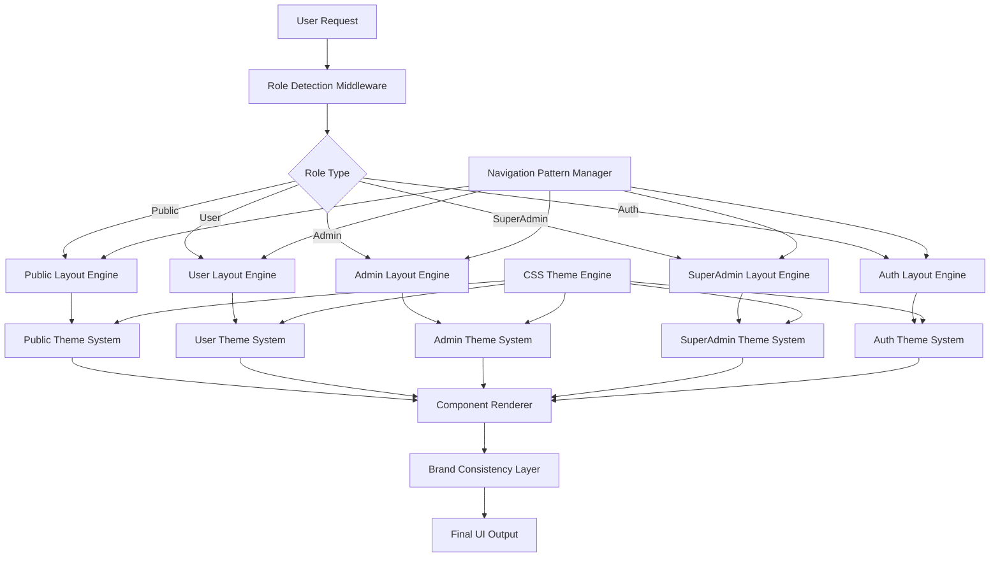

# Design Document: Role-Based UI Consistency System

## Overview

The Role-Based UI Consistency System establishes a comprehensive framework for maintaining distinct, cohesive user interfaces across all user roles in the Whispering Pages platform. This system ensures complete visual separation between Public, User, Admin, SuperAdmin, and Authentication interfaces while maintaining brand consistency and optimal user experience within each role context.

The design implements a multi-layered approach combining layout templates, CSS theming engines, component libraries, and navigation patterns to create role-specific experiences that eliminate UI mixing and provide clear visual hierarchies appropriate for each user type's needs and responsibilities.

## Architecture

### System Architecture



### Layout Engine Architecture

The layout engine uses a hierarchical approach where each role has its own dedicated layout template that cannot be mixed with other roles:

1. **Layout Selection Layer**: Determines the appropriate layout based on user role
2. **Theme Application Layer**: Applies role-specific CSS variables and styling
3. **Component Rendering Layer**: Renders UI components with role-appropriate styling
4. **Navigation Integration Layer**: Injects role-specific navigation patterns
5. **Brand Consistency Layer**: Ensures brand elements remain consistent across roles

### CSS Theme Engine

The CSS theme engine utilizes CSS custom properties (variables) to create role-specific theming:

```css
:root {
    /* Base brand colors */
    --brand-primary: #6366F1;
    --brand-secondary: #EC4899;
}

.public-layout {
    --role-primary: #6366F1;
    --role-accent: #E5E7EB;
    --role-gradient: linear-gradient(135deg, #F0F4FF, #E0E7FF);
}

.user-layout {
    --role-primary: #3B82F6;
    --role-accent: #DBEAFE;
    --role-gradient: linear-gradient(135deg, #DBEAFE, #BFDBFE);
}

.admin-layout {
    --role-primary: #F59E0B;
    --role-accent: #FEF3C7;
    --role-gradient: linear-gradient(135deg, #FEF3C7, #FDE68A);
}

.superadmin-layout {
    --role-primary: #DC2626;
    --role-accent: #FEE2E2;
    --role-gradient: linear-gradient(135deg, #FEE2E2, #FECACA);
}

.auth-layout {
    --role-primary: #F59E0B;
    --role-accent: #FEF3C7;
    --role-gradient: linear-gradient(135deg, #FEF3C7, #FDE68A);
}
```

## Components and Interfaces

### Layout Template System

Each role has a dedicated Razor layout file that defines the complete page structure:

- `_LayoutPublic.cshtml`: Clean, minimal navigation with light theming
- `_LayoutUser.cshtml`: Personalized sidebar with user-specific features
- `_LayoutAdmin.cshtml`: Management-focused sidebar with administrative tools
- `_LayoutSuperAdmin.cshtml`: Comprehensive system administration interface
- `_LayoutAuth.cshtml`: Minimal, trust-building authentication interface

### Navigation Pattern Manager

The Navigation Pattern Manager ensures each role has appropriate menu structures:

**Public Navigation:**
- Browse Books
- Categories  
- Login/Register buttons
- About/Support links

**User Navigation:**
- Dashboard
- Explore Books
- Shopping Cart (with badge)
- Favorites
- My Orders
- Profile management

**Admin Navigation:**
- Dashboard with analytics
- Books management
- Categories management
- Add Book functionality
- Orders management
- Users management
- Activity logs

**SuperAdmin Navigation:**
- System dashboard
- User & role management
- Pending approvals
- Activity monitoring
- System settings
- Books management (inherited)

**Auth Navigation:**
- Minimal navigation
- Brand logo only
- No role-specific elements

### Component Library Structure

Each role utilizes a consistent component library with role-specific styling:

```csharp
public interface IRoleComponentRenderer
{
    string RenderButton(ButtonType type, string text, string action);
    string RenderCard(CardModel model);
    string RenderForm(FormModel model);
    string RenderDataTable(TableModel model);
    string RenderModal(ModalModel model);
}

public class PublicComponentRenderer : IRoleComponentRenderer
{
    private readonly string _roleTheme = "public-layout";
    // Implementation with public-specific styling
}

public class UserComponentRenderer : IRoleComponentRenderer  
{
    private readonly string _roleTheme = "user-layout";
    // Implementation with user-specific styling
}

// Similar implementations for Admin, SuperAdmin, Auth
```

### Theme Engine Implementation

The theme engine uses a cascading approach where role-specific CSS overrides base styles:

1. **Base Styles**: Common typography, spacing, and layout fundamentals
2. **Role Theme Layer**: Role-specific color schemes and visual treatments
3. **Component Styles**: Component-specific styling that respects role theming
4. **Brand Consistency Layer**: Ensures logo, footer, and core brand elements remain consistent

## Data Models

### Role Context Model

```csharp
public class RoleContext
{
    public UserRole Role { get; set; }
    public string LayoutTemplate { get; set; }
    public string ThemeClass { get; set; }
    public List<NavigationItem> NavigationItems { get; set; }
    public Dictionary<string, string> ThemeVariables { get; set; }
    public ComponentRenderingOptions ComponentOptions { get; set; }
}

public enum UserRole
{
    Public,
    User, 
    Admin,
    SuperAdmin,
    Auth
}
```

### Navigation Model

```csharp
public class NavigationItem
{
    public string Text { get; set; }
    public string Icon { get; set; }
    public string Controller { get; set; }
    public string Action { get; set; }
    public List<NavigationItem> SubItems { get; set; }
    public bool RequiresAuth { get; set; }
    public List<UserRole> AllowedRoles { get; set; }
}
```

### Theme Configuration Model

```csharp
public class ThemeConfiguration
{
    public string PrimaryColor { get; set; }
    public string AccentColor { get; set; }
    public string BackgroundGradient { get; set; }
    public string SidebarGradient { get; set; }
    public Dictionary<string, string> ComponentOverrides { get; set; }
    public TypographySettings Typography { get; set; }
}
```

### Component Styling Model

```csharp
public class ComponentStylingOptions
{
    public string ButtonPrimaryClass { get; set; }
    public string ButtonSecondaryClass { get; set; }
    public string CardClass { get; set; }
    public string FormControlClass { get; set; }
    public string ModalClass { get; set; }
    public string TableClass { get; set; }
}
```

## Correctness Properties

*A property is a characteristic or behavior that should hold true across all valid executions of a system-essentially, a formal statement about what the system should do. Properties serve as the bridge between human-readable specifications and machine-verifiable correctness guarantees.*

### Property 1: Role Layout Isolation
*For any* user role and system access, the UI system should render only the layout components designated for that specific role, with no cross-contamination from other role layouts
**Validates: Requirements 1.1, 1.3**

### Property 2: Complete Layout Replacement
*For any* role switch operation, the UI system should completely replace the current layout with the target role's layout, ensuring no remnants of the previous role's interface remain
**Validates: Requirements 1.2**

### Property 3: Role-Specific CSS Application
*For any* role-specific layout load, the UI system should apply only the CSS classes and styling rules designated for that role, with no unauthorized style inheritance
**Validates: Requirements 1.4**

### Property 4: Navigation Structure Isolation
*For any* role interface, the navigation structure should contain only menu items appropriate for that role, with no overlapping or shared menu items between different roles
**Validates: Requirements 1.5, 2.2**

### Property 5: Navigation Consistency Within Roles
*For any* page within a role interface, the navigation pattern should remain consistent in structure, behavior, positioning, and layout
**Validates: Requirements 2.1, 2.5**

### Property 6: Active State Indicators
*For any* current page or section within a role interface, the navigation should provide clear visual indicators showing the user's current location
**Validates: Requirements 2.3**

### Property 7: Role-Themed Interactions
*For any* interactive element within a role interface, hover states and active states should be consistent with that role's theme and styling
**Validates: Requirements 2.4, 3.5**

### Property 8: Role-Specific Color Palette Application
*For any* role-specific interface load, the theme engine should apply the designated color palette for that role, ensuring distinct primary colors, accent colors, and background gradients
**Validates: Requirements 3.1, 3.2**

### Property 9: Component Theming Consistency
*For any* UI component within a role interface, the theme engine should apply role-appropriate styling that maintains consistency within that role context
**Validates: Requirements 3.3, 9.1, 9.2, 9.3, 9.4, 9.5**

### Property 10: Typography Hierarchy Consistency
*For any* text elements within a role interface, the theme engine should maintain consistent typography hierarchy while applying role-specific font treatments
**Validates: Requirements 3.4**

### Property 11: User Data Presentation Consistency
*For any* user data display within a role interface, the UI system should use consistent card layouts and data presentation patterns appropriate for that role
**Validates: Requirements 5.3, 6.3**

### Property 12: Role-Specific Theming Application
*For any* role-specific content rendering, the UI system should apply the appropriate gradient backgrounds and themed component styling for that role
**Validates: Requirements 5.5, 6.5, 7.3, 7.5**

### Property 13: Authentication Form Consistency
*For any* authentication flow, the interface should provide consistent form layouts, validation patterns, feedback, and error messaging
**Validates: Requirements 8.2, 8.5**

### Property 14: Brand Element Consistency
*For any* role interface, the logo placement, sizing, brand name, and core brand elements should appear consistently while maintaining recognizable brand colors as accent elements
**Validates: Requirements 10.1, 10.2, 10.3**

### Property 15: Footer Consistency Across Roles
*For any* role interface, footer information and legal links should appear consistently across all role interfaces
**Validates: Requirements 10.4**

### Property 16: Brand Recognition During Role Transitions
*For any* role switch operation, the UI system should maintain brand recognition while clearly indicating the role change through theming
**Validates: Requirements 10.5**

## Error Handling

### Layout Resolution Errors
- **Missing Layout Template**: If a role-specific layout template is not found, the system should fall back to a default layout while logging the error
- **CSS Loading Failures**: If role-specific CSS files fail to load, the system should apply base styling to maintain functionality
- **Theme Configuration Errors**: Invalid theme configurations should trigger validation errors with clear messaging about the specific issue

### Navigation Errors
- **Invalid Menu Items**: Menu items that reference non-existent controllers or actions should be filtered out with appropriate logging
- **Permission Errors**: Users attempting to access unauthorized navigation items should receive appropriate error messages
- **Navigation State Corruption**: If navigation state becomes corrupted, the system should reset to the default navigation for the user's role

### Component Rendering Errors
- **Missing Component Templates**: If role-specific component templates are missing, fall back to base component templates
- **Theme Application Failures**: If theme application fails, use default styling while maintaining functionality
- **CSS Variable Resolution**: If CSS variables are undefined, provide fallback values to prevent broken styling

### Role Transition Errors
- **Invalid Role Assignments**: Attempts to assign invalid roles should be rejected with clear error messages
- **Layout Switching Failures**: If layout switching fails, maintain the current layout and log the error
- **Theme Transition Errors**: Failed theme transitions should fall back to the previous theme state

## Testing Strategy

### Dual Testing Approach
The role-based UI consistency system requires both unit testing and property-based testing to ensure comprehensive coverage:

- **Unit Tests**: Verify specific examples, edge cases, and error conditions for each role interface
- **Property Tests**: Verify universal properties across all roles and interface combinations
- Both approaches are complementary and necessary for comprehensive UI consistency validation

### Property-Based Testing Configuration
- **Testing Framework**: Use Playwright for C# to enable comprehensive UI testing with property-based test capabilities
- **Test Iterations**: Minimum 100 iterations per property test to ensure thorough coverage through randomization
- **Test Tagging**: Each property test must reference its design document property using the format: **Feature: role-based-ui-consistency, Property {number}: {property_text}**

### Unit Testing Focus Areas
Unit tests should concentrate on:
- Specific role interface examples demonstrating correct behavior
- Integration points between layout engines and theme systems
- Edge cases such as missing templates or invalid configurations
- Error conditions and fallback behavior validation

### Property Testing Focus Areas
Property tests should verify:
- Universal properties that hold across all role interfaces
- Comprehensive input coverage through role and configuration randomization
- Layout isolation and theme consistency across all possible combinations
- Navigation structure integrity across different user scenarios

### Test Environment Setup
- **Browser Testing**: Multi-browser testing across Chrome, Firefox, and Edge
- **Responsive Testing**: Verify role consistency across different screen sizes
- **Performance Testing**: Ensure role switching and theme application performance meets requirements
- **Accessibility Testing**: Verify role interfaces meet accessibility standards consistently

### Continuous Integration
- All UI consistency tests must pass before deployment
- Automated visual regression testing to catch unintended UI changes
- Performance benchmarks for role switching and theme application
- Cross-browser compatibility validation in CI pipeline