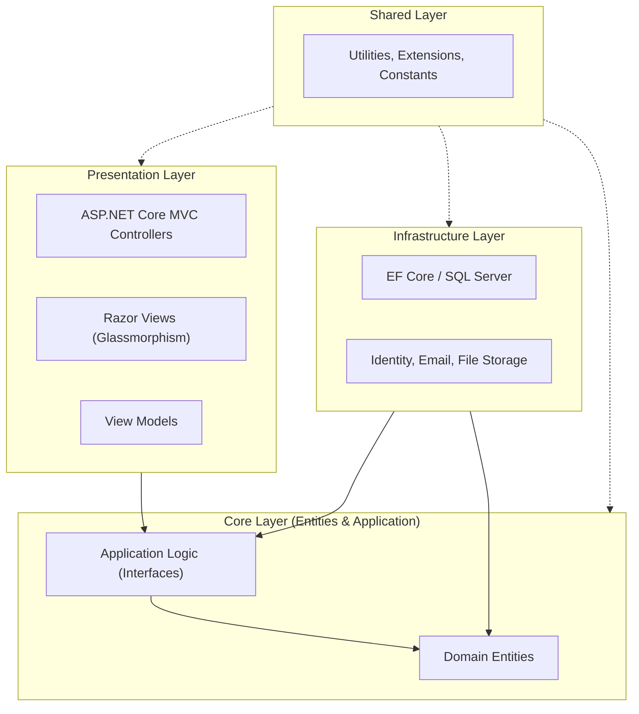

# Architecture Documentation - Whispering Pages

## 📐 Overview
Whispering Pages is built following **Clean Architecture** (Onion Architecture) principles. The primary goal of this architecture is to create a system that is independent of frameworks, UI, database, or any external agency, making it highly testable and maintainable.

## 🏗️ Architectural Layers

### 1. Core Layer (`Core/`)
The center of the "onion". It contains zero dependencies on external libraries or other layers.
- **Domain Entities:** Pure C# classes representing business objects (e.g., `Book`, `Order`, `ApplicationUser`).
- **Application Interfaces:** Defines the contracts for services (`IBookService`, `IOrderQueryService`) that the outer layers must implement.
- **Mappings:** AutoMapper profiles for converting between Entities and ViewModels.

### 2. Infrastructure Layer (`Infrastructure/`)
Contains implementations of the interfaces defined in the Core.
- **Data Persistence:** Entity Framework Core (supporting SQLite, SQL Server, PostgreSQL).
- **Authentication:** Implementation of ASP.NET Core Identity and JWT token generation.
- **Caching:** Multi-level caching strategies (Memory cache, Distributed cache).
- **External Integrations:** Services for image processing (ImageSharp), email (MailKit), and logging (Serilog).

### 3. Presentation Layer (`Presentation/`)
The entry point of the application.
- **Controllers:** Handle HTTP requests and orchestrate calls to application services.
- **Views:** Highly interactive Razor views using a custom **"Pastel Glassmorphic"** design system.
- **BEM CSS:** Structured styling following the Block-Element-Modifier convention.

### 4. Shared Layer (`Shared/`)
Common utilities used across all layers to prevent code duplication.
- Data validation attributes.
- Custom exception types.
- Extension methods for common types.

## 💎 SOLID Principles Implementation

| Principle | Implementation in Whispering Pages |
| :--- | :--- |
| **S**ingle Responsibility | Controllers only handle request routing; business logic resides in Services. |
| **O**pen/Closed | The generic repository and service interfaces allow extending functionality without modifying existing code. |
| **L**iskov Substitution | Services can be swapped (e.g., `MockEmailService` vs `MailKitEmailService`) without breaking consumers. |
| **I**nterface Segregation | Specific interfaces like `IBookQueryService` and `IBookCommandService` prevent bulky, all-in-one contracts. |
| **D**ependency Inversion | High-level modules (Controllers) depend on abstractions (Interfaces), not concrete implementations. |

## 🔄 Data Flow
1. **Request:** A user interaction triggers an action in a `Presentation` controller.
2. **Orchestration:** The controller calls an `Application` interface.
3. **Execution:** The `Infrastructure` implementation of that interface executes the logic, interacting with the `Domain` entities and `Database`.
4. **Response:** Data is mapped to a `ViewModel` and returned to the UI.

---
*For more details on technical implementation, see the [Technical Documentation](./TECHNICAL_DOCS.md).*
